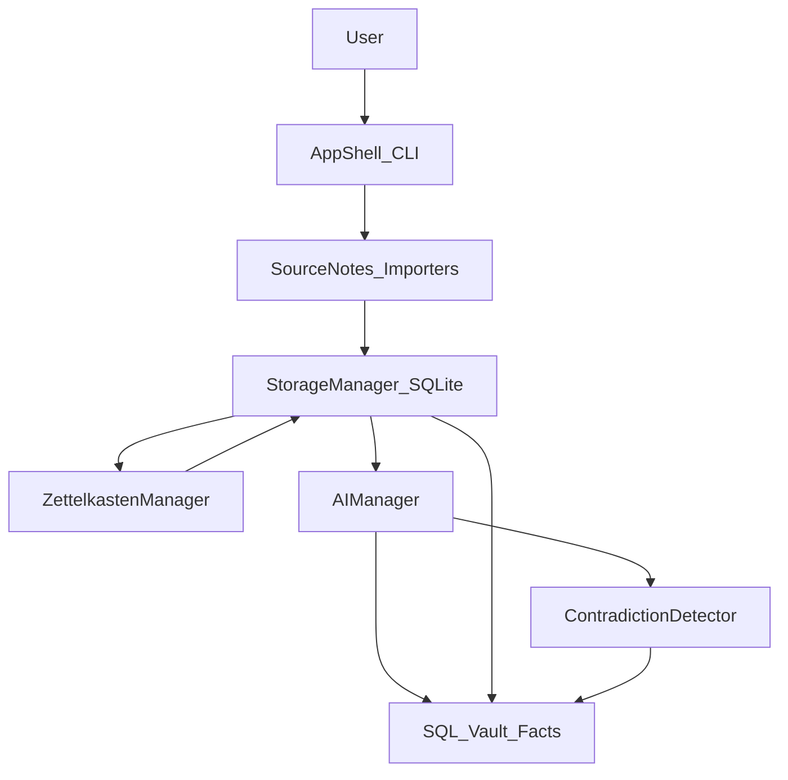

## Academic Audit Tool – Extension Plan

### 1. Assumptions & Goals

- **Assumptions**:
  - Core architecture from the existing plan (SourceNotes → StorageManager → ZettelkastenManager → AIManager + CLI) is either implemented or will be implemented as described.
  - SQLite is the main persistence layer; we will extend its schema rather than adding a second DB.
  - Initial UX is CLI-first; web UI can be added later by calling the same services.
- **High-level goals**:
  - **Source Anchoring**: Every AI-generated note or summary can show the exact YouTube timestamp or PDF page used.
  - **Contradiction Detection**: For a topic/assignment, compare claims from multiple sources (video, PDFs, notes) and flag conflicts.
  - **SQL Vault**: Store structured, searchable "Verified Facts" and their evidence links inside the existing SQLite DB.

---

### 2. Data Model Extensions

- **2.1 Source segments for anchoring**
  - **New dataclass** in `Module_SourceNotes` (e.g. `SourceSegment`):
    - `id`, `source_note_id`, `text`, `anchor_type` ("youtube_timestamp" | "pdf_page"), `anchor_value` (e.g. `00:05:32` or `12`), optional `metadata` (JSON for time ranges, section titles, etc.).
  - **SQLite table** `source_segments`:
    - `id` (PK), `source_note_id` (FK → `source_notes` or `notes`-equivalent), `text`, `anchor_type`, `anchor_value`, `extra_metadata` (JSON or TEXT), `created_at`.
  - **StorageManager API** additions:
    - `save_source_segments(segments: List[SourceSegment]) -> List[int]`.
    - `get_segments_for_source(source_note_id) -> List[SourceSegment]`.
- **2.2 Notes with anchors**
  - Extend `Note` dataclass in `Module_Zettelkasten` with optional `source_segment_id`.
  - Add `source_segment_id` column to `notes` table; index it to allow fast joins back to segments.
  - When creating atomic notes, either:
    - Map each note 1:1 to a `SourceSegment`, or
    - Associate each note with the *primary* segment that best represents its content.
- **2.3 SQL Vault schema for Verified Facts & conflicts**
  - `**facts` table**:
    - `id` (PK), `statement` (TEXT), `status` ("candidate" | "verified" | "conflicted"), `topic` (assignment / concept tag), `created_at`, `updated_at`.
  - `**fact_sources` table** (evidence links):
    - `id` (PK), `fact_id` (FK → `facts`), `source_segment_id` (FK → `source_segments`), `support_type` ("support" | "contradict"), `confidence` (REAL 0–1), `notes` (TEXT).
  - Optional `**conflicts` table** for human-friendly reports:
    - `id`, `fact_id`, `description`, `severity` ("minor" | "major"), `resolved` (BOOL), `created_at`.
  - **StorageManager API** additions:
    - `create_fact(statement, topic, status='candidate') -> fact_id`.
    - `link_fact_to_segment(fact_id, segment_id, support_type, confidence, notes=None)`.
    - `search_facts(query: str, topic: Optional[str]) -> List[Fact]` (backed by FTS on `facts.statement`).
    - `get_fact_with_evidence(fact_id) -> (Fact, List[FactSource])`.

---

### 3. Source Anchoring Pipeline

- **3.1 YouTube transcript ingestion with timestamps**
  - Update the existing YouTube transcript importer to retain per-line timestamps from `youtube-transcript-api` instead of flattening to plain text.
  - For each transcript chunk, build a `SourceSegment` with:
    - `text` = chunk text.
    - `anchor_type` = `"youtube_timestamp"`.
    - `anchor_value` = starting timestamp, stored as `HH:MM:SS` string or seconds integer.
  - Persist segments via `StorageManager.save_source_segments()` immediately after or alongside saving the parent `SourceNote`.
- **3.2 PDF importer with page numbers**
  - Design a `PdfImporter` class (inside `SourceNotes` or a sibling importer module):
    - Extract text per page using a PDF library (e.g. `pypdf` or `pdfplumber`, later wired into `requirements.txt`).
    - Create one `SourceSegment` per page (or per logical chunk) with `anchor_type="pdf_page"` and `anchor_value=<page_number>`.
    - Assemble the full `raw_text` for the `SourceNote` as concatenation of page texts for compatibility with existing flows.
  - Save the `SourceNote` and related `SourceSegment` records via `StorageManager`.
- **3.3 Connecting segments to atomic notes**
  - Update `ZettelkastenManager.create_notes_from_source` to accept both `SourceNote` and its `SourceSegment`s:
    - Strategy A: For simple implementation, create exactly one note per segment, using segment text as note body.
    - Strategy B (later): Allow splitting within a segment but always record the originating `source_segment_id` in each note.
  - Ensure each created `Note` carries `source_segment_id` so every note can show a source anchor in the UI.
- **3.4 CLI/UI for anchored notes**
  - Expand the note view command to display:
    - `Source: <title> @ <timestamp>` for YouTube-backed notes.
    - `Source: <title> p.<page>` for PDF-backed notes.
  - For CLI, print a friendly anchor string and (optionally) a helper command hint (e.g. `open_video <note_id>` that launches a browser with `&t=<seconds>` parameter).

---

### 4. SQL Vault: Verified Facts Workflow

- **4.1 Fact creation from notes**
  - Add methods to `AIManager` for structured fact extraction:
    - `extract_facts_from_notes(notes: List[Note], topic: str) -> List[FactDraft]`, where each `FactDraft` contains `statement`, `note_ids`, and model confidence.
  - Implement a service function (could live in `ZettelkastenManager` or a new `AuditManager` module):
    - For each `FactDraft`:
      - Call `StorageManager.create_fact(statement, topic, status='candidate')`.
      - For each associated `Note`, resolve its `source_segment_id` and call `link_fact_to_segment(..., support_type='support')`.
  - Expose a CLI command, e.g. `audit extract-facts --topic "CS50_Week1" --source-notes <ids>`.
- **4.2 Fact verification and promotion**
  - Provide commands to:
    - List candidate facts for a topic with their evidence snippets.
    - Manually mark a fact as `verified` (e.g. `audit verify-fact <id>`), which updates `facts.status`.
  - Optionally add a simple heuristic auto-verifier: if all evidence segments have high confidence and no contradictions recorded, promote to `verified`.
- **4.3 Searching the SQL Vault**
  - Add FTS or indexed search over `facts.statement`.
  - CLI commands:
    - `facts search <query>` → list matching facts with topic and status.
    - `facts show <id>` → show statement plus supporting segments, each with anchors.
  - This gives you the "searchable database of Verified Facts" behavior.

---

### 5. Contradiction Detection Engine

- **5.1 Topic-level claim grouping**
  - Define a notion of **topic or assignment** (string tag):
    - Associate this topic with `SourceNote`s and/or `Note`s during ingestion (e.g. CLI prompts for `topic` when adding sources).
  - Build a helper that fetches all notes (and their segments) for a given topic from `StorageManager`.
- **5.2 Candidate conflict generation**
  - Extend `AIManager` with a method:
    - `cluster_and_compare_facts(facts_or_notes) -> List[FactComparison]`, where each comparison links two or more claims and classifies them as `same`, `paraphrase`, `conflict`, or `unrelated`.
  - Implementation approach:
    - Option 1 (simpler): Ask the LLM directly: "Given these statements, which ones contradict each other?" and parse structured JSON output.
    - Option 2 (later): Use embeddings to cluster similar statements, then call the LLM only on cluster members.
- **5.3 Recording conflicts in the Vault**
  - For each `FactComparison` marked `conflict`:
    - Ensure each claim is stored as a `fact` (create if needed).
    - For each evidence segment, create `fact_sources` entries with `support_type='support'` for the claim it supports.
    - Create or update a `conflicts` row summarizing the contradiction (e.g. "Video says exam is open book; PDF says closed book").
    - Mark affected facts with `status='conflicted'`.
- **5.4 CLI/UI for conflict reports**
  - New command: `audit find-conflicts --topic <topic>`:
    - Runs the contradiction detection pipeline.
    - Prints a table: `Fact A` vs `Fact B`, with short evidence snippets and anchors (timestamp/page) for each.
  - New command: `audit resolve-conflict <conflict_id> --resolution-note "..."`:
    - Allows you to record how a conflict was resolved (manually or via new evidence).

---

### 6. Integration with Existing Phases

- **Phase 2 extension (StorageManager)**:
  - Incorporate new tables: `source_segments`, `facts`, `fact_sources`, and optionally `conflicts` into the initial schema + FTS setup.
  - Ensure migrations or `CREATE TABLE IF NOT EXISTS` logic handle upgrades from the earlier schema.
- **Phase 3 extension (Zettelkasten Core)**:
  - Modify note creation to use `SourceSegment`s and populate `source_segment_id` on each note.
- **Phase 4 extension (Search & Retrieval)**:
  - Add note-view enhancements to show anchors.
  - Add search over `facts` in addition to existing `notes` search.
- **Phase 5 extension (AI Manager)**:
  - Implement the new AI methods for fact extraction and conflict detection on top of the same LLM/embedding provider used for summaries.

---

### 7. Implementation Order (Suggested)

- **Step 1 – Schema & models**
  - Add/extend dataclasses: `SourceSegment`, `Fact`, `FactSource`, optional `Conflict`.
  - Extend SQLite schema and `StorageManager` to handle segments and vault tables.
- **Step 2 – Anchored ingestion**
  - Update YouTube importer to produce `SourceSegment`s with timestamps.
  - Implement initial PDF importer producing page-based `SourceSegment`s.
  - Wire `ZettelkastenManager` to use segments when creating notes.
- **Step 3 – Anchored note UX**
  - Update CLI note view to display source anchors.
  - Add helper commands to open a video at a timestamp or reference a PDF page.
- **Step 4 – Fact extraction & SQL Vault**
  - Implement `AIManager.extract_facts_from_notes` and related service functions.
  - Add CLI commands to extract, verify, and search facts.
- **Step 5 – Contradiction detection**
  - Implement topic-based note/fact retrieval.
  - Implement contradiction detection in `AIManager` and persist conflicts.
  - Add CLI commands for `audit find-conflicts` and `audit resolve-conflict`.
- **Step 6 – Hardening & tests**
  - Add tests for: segment creation from transcript/PDF, note ↔ segment linkage, fact creation and evidence linking, contradiction detection pipeline (using mocked AI responses).
  - Update documentation to explain the Academic Audit Tool features and example workflows.

