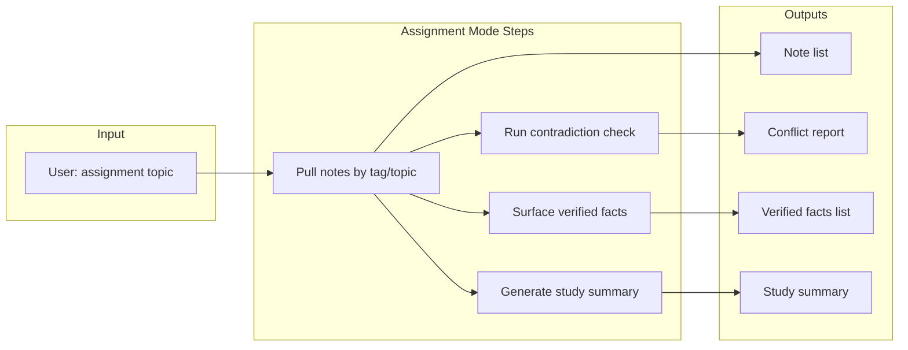

# Anki Export and Assignment Mode – Integration Plan

This plan extends the [Zettelkasten app architecture](.cursor/plans/zettelkasten-app-architecture-and-roadmap_320d31e7.plan.md) and the [Academic Audit Tool extension](.cursor/plans/academic-audit-tool-extension_c2a1660c.plan.md) with two features aimed at day-to-day study workflows.

---

## Phase placement summary

| Feature             | Earliest phase               | Depends on                                                      | Suggested implementation phase                           |
| ------------------- | ---------------------------- | --------------------------------------------------------------- | -------------------------------------------------------- |
| **Export to Anki**  | After Phase 4                | Atomic notes (Phase 3), StorageManager notes (Phase 2)          | **Phase 4.5** or early Phase 5                           |
| **Assignment Mode** | After Audit Step 5 + Phase 5 | Tags/topics, facts vault, contradiction detection, AI summarize | **New phase after Audit + Phase 5** (e.g. Phase 5.5 / 6) |

---

## 1. Export to Anki / Spaced Repetition

### 1.1 Goal

Convert atomic notes into flashcards automatically so students can import them into Anki (or other SRS tools) and study without leaving the app workflow.

### 1.2 Phase placement and dependencies

- **Requires**: Phase 2 (notes in DB with `title`, `body`), Phase 3 (atomic notes created by `ZettelkastenManager`). Optional: tags (Phase 2 optional `tags` / `note_tags`) for deck filtering.
- **Implement after**: Phase 4 (Search and Retrieval), when the Note model and retrieval are stable. Can be done in parallel with Phase 5 or as a short sprint right after Phase 4.
- **Does not require**: Academic Audit (facts, contradictions), or AI—so it can ship earlier and stay useful even before the full audit stack exists.

### 1.3 Design

- **New module or submodule**: e.g. `Module_Export/anki_export.py` or `Module_Zettelkasten/anki_export.py`.
- **Input**: List of `Note` objects (from StorageManager / ZettelkastenManager). Notes can be selected by:
  - Tag/topic (e.g. all notes with tag `CS50_Week3`), once tags exist in schema.
  - Search query (reuse `StorageManager.search_notes`).
  - Explicit note IDs.
- **Card generation** (choose one or both):
  - **Simple**: One card per note — front = `note.title` (or first sentence of body), back = `note.body`.
  - **Optional (AI)**: Use `AIManager` to generate Q&A pairs from note body, then one card per pair (requires Phase 5 AIManager).
- **Output format**:
  - **Anki**: Use a library such as [genanki](https://github.com/kerrickstaley/genanki) to produce a `.apkg` deck file (standard Anki package).
  - **Generic SRS**: Optional CSV export (e.g. `front,back`) for import into Anki or other tools.
- **StorageManager**: No new tables required if reusing existing `notes` (and optional `note_tags`). Optional: store export metadata (e.g. `last_exported_at` per deck name) in a small table if you want to support “export only new/changed notes” later.

### 1.4 API and CLI sketch

- **Service** (e.g. in `AnkiExporter` class):
  - `notes_to_cards(notes: List[Note], style: "simple" | "qa") -> List[Card]`  
    - `Card` = dataclass `(front: str, back: str)`.
  - `export_deck(cards: List[Card], deck_name: str, output_path: Path) -> None`  
    - Writes `.apkg` (and optionally CSV).
- **CLI** (in `main.py` or dedicated CLI module):
  - `export anki --tag CS50_Week3 --deck "CS50 W3" --output ./decks/`
  - `export anki --query "pointers" --deck "C Review" --output ./decks/`
  - `export anki --note-ids 1,2,3 --deck "Custom" --output ./decks/`

### 1.5 Implementation order (within this feature)

1. Add `Module_Export` (or submodule under Zettelkasten) and `AnkiExporter` with simple note→card mapping and genanki-based `.apkg` export.
2. Add CLI commands that get notes via existing StorageManager (by IDs; by search query once FTS exists; by tag once `tags`/`note_tags` exist).
3. Optional: Integrate AIManager to generate Q&A-style cards when `--style qa` is requested (after Phase 5).

---

## 2. Assignment Mode

### 2.1 Goal

User says: “I’m studying for CS50 Week 3.” The app:

1. Pulls all notes tagged (or associated with) that assignment/topic (e.g. `CS50_Week3`).
2. Runs the contradiction check for that topic.
3. Surfaces verified facts from the SQL Vault.
4. Generates a study summary.

### 2.2 Phase placement and dependencies

- **Requires**:
  - **Tags/topics**: Notes (and optionally sources) must be associable with a topic/assignment string (e.g. `CS50_Week3`). The Academic Audit plan already uses `topic` on the `facts` table and “topic or assignment” in section 5.1; the main roadmap’s Phase 2 mentions optional `tags` and `note_tags` tables. Assignment Mode needs at least one of: (a) notes tagged by topic, or (b) facts filtered by topic with a way to get the underlying notes.
  - **Contradiction detection**: Academic Audit Step 5 (`audit find-conflicts --topic`).
  - **Verified facts vault**: Academic Audit Step 4 (fact extraction, verification, search).
  - **AI summarization**: Phase 5 AIManager (`summarize_note_text` or a batch variant).
- **Implement after**: Academic Audit extension Steps 4 and 5 are done, and Phase 5 (AIManager) is in place. So Assignment Mode is a **new phase** (e.g. Phase 5.5 or Phase 6), before or alongside the optional Web UI (current Phase 6).

### 2.3 Design

- **Single entry point**: One CLI command or mode that orchestrates the four steps. Examples:
  - `study --assignment "CS50 Week 3"`  
  - `assignment "CS50_Week3"`  
  - Or a dedicated menu: “Assignment mode” → prompt for topic string.
- **Topic resolution**: Reuse the same “topic” concept as in the Academic Audit plan. Ensure you can:
  - Get all notes for a topic (e.g. via `note_tags` if tags are `CS50_Week3`, or via facts: get all facts for topic → get their evidence segments → get notes linked to those segments).
  - Get all facts for a topic (already in Audit: `search_facts(..., topic=...)`).
- **Orchestration flow**:

- **New component**: An `AssignmentStudyService` (or “Assignment Mode” handler) that:
  1. Takes `topic: str` (e.g. `"CS50_Week3"`).
  2. Calls StorageManager (and/or Audit helpers) to get notes for that topic.
  3. Calls the existing contradiction pipeline for that topic (same as `audit find-conflicts --topic`).
  4. Fetches verified facts for the topic (`search_facts` or `get_facts_for_topic` with `status='verified'`).
  5. Calls AIManager to generate a study summary (e.g. `summarize_notes(notes: List[Note])` or summarize concatenated note bodies).
  6. Returns or prints: note list (optional), conflict report, verified facts, and summary. Optionally writes summary to a file or attaches it to the topic for later.

### 2.4 API and CLI sketch

- **Service** (e.g. in `Module_Audit/assignment_study.py` or under `Module_Zettelkasten`):
  - `run_assignment_mode(topic: str) -> AssignmentReport`
  - `AssignmentReport` = dataclass with: `notes: List[Note]`, `conflicts: List[ConflictReport]`, `verified_facts: List[Fact]`, `study_summary: str`.
- **CLI**:
  - `study --assignment "CS50 Week 3"`  
    - Prints or saves: (1) count of notes pulled, (2) conflict summary (and details if any), (3) verified facts with evidence snippets, (4) study summary.
  - Optional: `study --assignment "CS50 Week 3" --export-anki`  
    - After running assignment mode, triggers Anki export for the same topic (links Feature 1 and Feature 2).

### 2.5 Implementation order (within this feature)

1. Ensure topic/tag is consistently represented in the schema and that you can retrieve all notes for a topic (extend StorageManager / Audit helpers as in the Academic Audit plan).
2. Implement `AssignmentStudyService.run_assignment_mode(topic)` that:
  - Gets notes for topic.
  - Calls existing contradiction detection for topic.
  - Gets verified facts for topic.
  - Calls AIManager to generate study summary.
3. Add CLI command `study --assignment <topic>` that calls this service and formats output.
4. Optional: Add `--export-anki` to the same command to export the assignment’s notes to an Anki deck.

---

## 3. How this fits into the existing roadmap

- **Zettelkasten roadmap**: Export to Anki fits after Phase 4 (and optionally uses Phase 5 AI). Assignment Mode fits as a new phase after Phase 5 and after the Academic Audit extension is implemented (Steps 4 and 5).
- **Academic Audit extension**: Assignment Mode is the main consumer of the audit tool (contradiction check + verified facts). Topic/tag must be shared between notes and facts (already assumed in the Audit plan).
- **Suggested sequence**:
  1. Complete Phase 1–4 and Academic Audit Steps 1–5 as in the existing plans.
  2. Add **Export to Anki** once Phase 4 is done (Phase 4.5 or early Phase 5).
  3. After Phase 5 (AIManager) and Audit Steps 4–5, add **Assignment Mode** as the next phase (Phase 5.5 / 6), then proceed to optional Web UI and quality/testing.

---

## 4. File and module summary

| Item                     | Location / change                                                                                                          |
| ------------------------ | -------------------------------------------------------------------------------------------------------------------------- |
| Anki export logic        | New: `Module_Export/anki_export.py` (or `Module_Zettelkasten/anki_export.py`)                                              |
| Card/deck types          | `AnkiExporter`, `Card` dataclass in same module                                                                            |
| Assignment orchestration | New: `Module_Audit/assignment_study.py` (or under existing audit module) with `AssignmentStudyService`, `AssignmentReport` |
| CLI: export anki         | Extend `main.py` (or CLI module): `export anki --tag/--query/--note-ids ...`                                               |
| CLI: assignment mode     | Extend `main.py`: `study --assignment "..."`                                                                               |
| Dependencies             | Add `genanki` (and optionally CSV handling) to `requirements.txt` for Anki export                                          |

No new database tables are strictly required for Anki export. Assignment Mode uses the existing Audit schema (facts, fact_sources, conflicts) and requires topic-scoped retrieval of notes and facts (tags/note_tags or topic on facts + segment→note linkage as in the Audit plan).