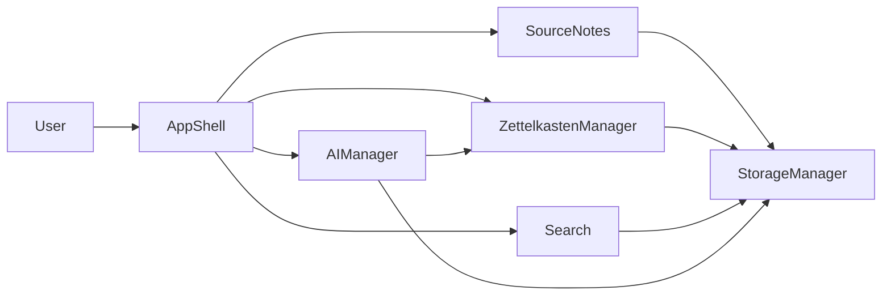

# Simplified Zettelkasten App Plan (All Phases)

This plan restates the [Zettelkasten architecture plan](.cursor/plans/zettelkasten-app-architecture-and-roadmap_320d31e7.plan.md) and the [Academic Audit extension](.cursor/plans/academic-audit-tool-extension_c2a1660c.plan.md) in plain language, with concrete methods and attributes for each phase. It aligns with your existing code in [main.py](main.py), [Module_SourceNotes/source_notes.py](Module_SourceNotes/source_notes.py), [storage.py](storage.py), and the empty [Module_AiManager/ai_manager.py](Module_AiManager/ai_manager.py).

---

## High-Level Flow

- **Ingestion**: SourceNotes turns URLs/files/text into a single `SourceNote` (and later `SourceSegment`s).
- **Storage**: StorageManager (SQLite + FTS) stores notes, links, segments, and (later) facts.
- **Zettelkasten core**: ZettelkastenManager turns a SourceNote into many small atomic notes and links them.
- **Search**: User searches notes and views a note with its links.
- **AI**: AIManager summarizes and suggests links; later it powers fact extraction and contradiction detection.

---

## Phase 1 – Source Notes (Canonical Objects, No Direct File Writing)

**Goal:** One clear data shape for “something we imported.” All importers (YouTube, PDF, manual) return that shape. File writing moves to storage.

### Data structure (new: `Module_SourceNotes/models.py`)

| Name          | Type      | Meaning                                           |
| ------------- | --------- | ------------------------------------------------- |
| `SourceNote`  | dataclass | One imported source (video, PDF, or manual text). |
| `id`          | str       | Unique ID (e.g. UUID).                            |
| `title`       | str       | Human-readable title.                             |
| `source_type` | str       | `"youtube"`                                       |
| `source_url`  | str       | None                                              |
| `raw_text`    | str       | Full extracted text.                              |
| `created_at`  | datetime  | When it was imported.                             |

### Class: `SourceNotes` (refactor of existing [source_notes.py](Module_SourceNotes/source_notes.py))

**Attributes**

- (Optional) `_storage: StorageManager` – if set, save there instead of files.

**Methods**

- `from_youtube(url: str) -> SourceNote`  
  - Get video ID, fetch transcript (reuse [youtube_processor](Module_SourceNotes/youtube_processor.py) or current logic).  
  - Build and return `SourceNote` (id, title, `source_type="youtube"`, `source_url=url`, `raw_text=transcript`, `created_at`).  
  - Do **not** write `.txt` here; optionally pass `SourceNote` to `StorageManager` if available.
- `from_manual_input(text: str, title: str) -> SourceNote`  
  - Return `SourceNote` with `source_type="manual"`, `raw_text=text`, `title=title`.
- `from_pdf(pdf_input: str) -> SourceNote`  
  - Reuse existing PDF logic (URL or path), but return one `SourceNote` with full concatenated text instead of writing a file.

**Deliverable:** Callers get a `SourceNote`; saving to disk/DB is the responsibility of StorageManager (Phase 2).

---

## Phase 2 – StorageManager and Data Model (SQLite + FTS)

**Goal:** One place that owns all persistence: source notes, atomic notes, links, and later segments and facts.

### Class: `StorageManager` (new: `Module_Storage/storage.py`; can evolve current [storage.py](storage.py) / `Databasemanager`)

**Attributes**

- `_db_path: str` – path to SQLite file (e.g. from config/env).
- `_conn` – SQLite connection (or factory like current `get_connection()`).

**Schema (main tables)**

- **notes** – `id`, `title`, `body`, `source_type`, `source_url`, `source_note_id` (FK to source), `source_segment_id` (FK, nullable; used in Academic Audit), `created_at`.
- **links** – `id`, `from_note_id`, `to_note_id`, `relation_type` (e.g. `"reference"`, `"similar"`, `"ai_suggested"`).
- **source_segments** (Academic Audit) – `id`, `source_note_id`, `text`, `anchor_type` (`"youtube_timestamp"`  `"pdf_page"`), `anchor_value` (e.g. `"00:05:32"` or `12`), `extra_metadata` (JSON/TEXT), `created_at`.
- **notes_fts** – FTS5 virtual table on `title` + `body` for fast search.

**Methods**

- `save_source_note(source_note: SourceNote) -> str` – insert, return `note_id`.
- `get_note(note_id: str) -> Note | None` – load one note (your `Note` dataclass from Phase 3).
- `search_notes(query: str) -> list[Note]` – query FTS, return list of notes.
- `create_link(from_id: str, to_id: str, relation_type: str) -> str` – insert link, return link id.
- `get_links(note_id: str) -> list[tuple[str, str, str]]` – e.g. list of `(from_id, to_id, relation_type)` for that note (incoming + outgoing or two methods if you prefer).
- (Academic Audit) `save_source_segments(segments: list[SourceSegment]) -> list[int]` – insert segments, return IDs.
- (Academic Audit) `get_segments_for_source(source_note_id: str) -> list[SourceSegment]`.

**Deliverable:** SourceNotes and ZettelkastenManager use StorageManager for all reads/writes; no direct file writes for “saved notes.”

---

## Phase 3 – Zettelkasten Core (Atomic Notes from Sources)

**Goal:** Turn one `SourceNote` (long text) into many small “atomic” notes and store them with optional links. Optionally attach each note to a source segment for anchoring.

### Data structure (e.g. in `Module_Zettelkasten/models.py` or same file)

| Name                | Type      | Meaning                                        |
| ------------------- | --------- | ---------------------------------------------- |
| `Note`              | dataclass | One atomic Zettelkasten note.                  |
| `id`                | str       | Unique ID.                                     |
| `source_note_id`    | str       | Which SourceNote this came from.               |
| `source_segment_id` | str       | None                                           |
| `title`             | str       | Short title (e.g. from heading or first line). |
| `body`              | str       | Full note text.                                |
| `created_at`        | datetime  | Creation time.                                 |

### Class: `ZettelkastenManager` (new: `Module_Zettelkasten/zettelkasten.py`)

**Attributes**

- `_storage: StorageManager` – where to save notes and links.

**Methods**

- `create_notes_from_source(source_note: SourceNote, segments: list[SourceSegment] | None = None) -> list[Note]`  
  - Split `source_note.raw_text` into chunks (e.g. by double newline or ~3–5 sentences).  
  - If `segments` is provided (Academic Audit), map each note to a segment and set `source_segment_id`.  
  - For each chunk: build `Note`, save via `_storage.save_note()` (or a single batch API), then return the list.
- `link_notes_by_keywords(notes: list[Note]) -> None`  
  - Simple first pass: find notes that share important words, call `_storage.create_link(from_id, to_id, "similar")` (or another relation type).
- (Optional) `get_note(note_id: str) -> Note | None` – delegate to `_storage.get_note`.

**Deliverable:** After adding a source, the app can call `create_notes_from_source` and persist atomic notes (and segments when available) through StorageManager.

---

## Phase 4 – Search and Retrieval (CLI: Add Source, Search, View Note)

**Goal:** User can add a source, search notes by text, and open a note and see its links.

### Methods (on existing or new modules)

- **Search:** Use `StorageManager.search_notes(query)` and format results (e.g. title + first line of body).
- **Note view:** `StorageManager.get_note(id)` + `StorageManager.get_links(id)`; print full note and list of linked notes (and, in Academic Audit, show source anchor: “Source:  @ 00:05:32” or “p.12”).

### CLI ([main.py](main.py)) – main loop

- Options: `1) Add source`, `2) Search notes`, `3) View note`, `4) Exit`.
- Add source: ask for URL or path or paste text → call SourceNotes (`from_youtube` / `from_pdf` / `from_manual_input`) → `StorageManager.save_source_note` → optionally `ZettelkastenManager.create_notes_from_source` and persist.
- Search: prompt for query → call search → print list.
- View note: prompt for note id → load note + links → print; if you have segments, show anchor.

**Deliverable:** End-to-end flow: ingest → store → split into notes → search and view with links (and anchors when implemented).

---

## Phase 5 – AI Manager (Summaries and Suggested Links)

**Goal:** Summarize text and suggest which notes should be linked; later (Academic Audit) extract facts and detect contradictions.

### Class: `AIManager` (implement in [Module_AiManager/ai_manager.py](Module_AiManager/ai_manager.py))

**Attributes**

- `_api_client` – e.g. OpenAI or Groq client (from env/config).
- (Optional) `_zettelkasten: ZettelkastenManager` – to fetch candidates.
- (Optional) `_storage: StorageManager` – to read notes/facts.

**Methods**

- `summarize_note_text(text: str) -> str` – call LLM, return summary string.
- `suggest_links_for_note(note: Note, candidates: list[Note]) -> list[tuple[str, float]]` – return list of `(note_id, score)` for notes that might link (e.g. by embeddings or LLM).
- (Academic Audit) `extract_facts_from_notes(notes: list[Note], topic: str) -> list[FactDraft]` – each FactDraft: `statement`, `note_ids`, confidence.
- (Academic Audit) `cluster_and_compare_facts(facts_or_notes) -> list[FactComparison]` – classify pairs as `same` / `paraphrase` / `conflict` / `unrelated`.

**Integration**

- CLI option: “Suggest connections for this note” → get candidates (e.g. top N from search) → `AIManager.suggest_links_for_note` → save links with `relation_type="ai_suggested"`.
- Optional: “Summarize this source” before or after creating atomic notes.

**Deliverable:** Users can trigger summaries and AI-suggested links; links are stored in the same `links` table.

---

## Phase 6 – Academic Audit Extensions (Anchors, Facts Vault, Contradictions)

**Goal:** Source anchoring (timestamp/page per note), a vault of verified facts with evidence, and contradiction detection per topic.

### Data structures (extend models)

- **SourceSegment** – `id`, `source_note_id`, `text`, `anchor_type`, `anchor_value`, `extra_metadata`, `created_at`.
- **Fact** – `id`, `statement`, `status` (`"candidate"`  `"verified"`  `"conflicted"`), `topic`, `created_at`, `updated_at`.
- **FactSource** – `id`, `fact_id`, `source_segment_id`, `support_type` (`"support"`  `"contradict"`), `confidence`, `notes`.
- **Conflict** (optional) – `id`, `fact_id`, `description`, `severity`, `resolved`, `created_at`.

### StorageManager additions

- Tables: `source_segments`, `facts`, `fact_sources`, `conflicts` (optional).
- Methods: `save_source_segments`, `get_segments_for_source`; `create_fact`, `link_fact_to_segment`, `search_facts`, `get_fact_with_evidence`; conflict helpers if you add the table.

### Ingestion changes

- **YouTube:** Keep timestamps when fetching transcript; for each chunk create a `SourceSegment` (`anchor_type="youtube_timestamp"`, `anchor_value=start time`); save segments with the SourceNote.
- **PDF:** Per-page (or per-chunk) create `SourceSegment` (`anchor_type="pdf_page"`, `anchor_value=page_num`).
- **ZettelkastenManager:** When creating notes from source, pass segments and set `Note.source_segment_id` so every note has an anchor.

### AIManager additions

- `extract_facts_from_notes` → create facts and link to segments via StorageManager.
- `cluster_and_compare_facts` → find conflicts; persist with `link_fact_to_segment(..., support_type="contradict")` and conflict rows.

### CLI additions

- Note view: show “Source:  @ HH:MM:SS” or “p.”.
- Commands: e.g. `audit extract-facts --topic X`, `audit verify-fact <id>`, `facts search <query>`, `audit find-conflicts --topic X`, `audit resolve-conflict <id>`.

**Deliverable:** Notes are anchored; facts are stored and searchable; contradictions can be found and resolved per topic.

---

## Phase 7 – Optional Web UI and Phase 8 – Quality and DX

- **Web UI:** Backend (e.g. FastAPI) that exposes endpoints for sources, notes, search, links, and AI (summarize, suggest links; later facts and conflicts). Frontend: simple UI to add source, search, view note with links and anchors, trigger AI.
- **Quality:** README (setup, run instructions), tests (splitting, search, links, segments, facts), type hints, config (DB path, API keys) via `.env`/`config.py`.

---

## Summary Table (Where Things Live)

| Phase | Main class(es)                   | Key data types                            | Main methods                                                                                                                                                             |
| ----- | -------------------------------- | ----------------------------------------- | ------------------------------------------------------------------------------------------------------------------------------------------------------------------------ |
| 1     | SourceNotes                      | SourceNote                                | from_youtube, from_pdf, from_manual_input                                                                                                                                |
| 2     | StorageManager                   | Note (DB row)                             | save_source_note, get_note, search_notes, create_link, get_links; save_source_segments, get_segments_for_source; (Audit) create_fact, link_fact_to_segment, search_facts |
| 3     | ZettelkastenManager              | Note                                      | create_notes_from_source, link_notes_by_keywords                                                                                                                         |
| 4     | CLI (main.py)                    | –                                         | Menu: add source, search, view note                                                                                                                                      |
| 5     | AIManager                        | –                                         | summarize_note_text, suggest_links_for_note; (Audit) extract_facts_from_notes, cluster_and_compare_facts                                                                 |
| 6     | StorageManager + AIManager + CLI | SourceSegment, Fact, FactSource, Conflict | Anchored ingestion; fact CRUD; contradiction detection + commands                                                                                                        |

This keeps the same scope as the two original plans but presents each phase with explicit classes, attributes, and methods you can implement step by step.