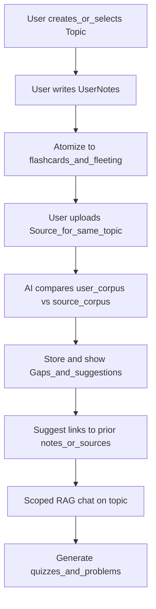

# Student-first study companion – restructured roadmap

## How this relates to [.cursor/plans/zettelkasten-app-architecture-and-roadmap_320d31e7.plan.md](.cursor/plans/zettelkasten-app-architecture-and-roadmap_320d31e7.plan.md)

**Old narrative (still valuable technically):** external source → `SourceNote` → storage → split into atomic notes → search → AI suggests links (+ optional Academic Audit: facts, contradictions, anchors).

**Your narrative:** user writes on a **topic** → app creates **flashcards / fleeting notes** → user adds **related sources** → AI **compares** user vs source → surfaces **gaps and what to revise** → suggests **links** to older material → **chat** scoped to corpus → **quizzes** with substantive problems.

**Better or worse?**

- **Better for the product:** It matches how students actually work (you already took notes; then you add the textbook or lecture). It forces first-class **topics/sessions**, **gap artifacts**, and **study actions** (quiz, chat) instead of treating everything as “another ingested transcript.”
- **Worse for a naive build order:** Source-first pipelines are easier to sequence (one long text in, many chunks out). Your flow needs **two corpora** (user notes + sources) and **comparison logic** early in the value story, which is more design surface area (IDs, permissions, “what is ground truth?”).
- **Verdict:** **Better as the north-star and UX order.** Technically you should **merge**, not replace: keep [Module_Storage/storage.py](Module_Storage/storage.py) / SQLite / FTS / links / [Module_SourceNotes](Module_SourceNotes) / [Module_AiManager](Module_AiManager) ideas, but **add entities** (`Topic`, `UserNote`, optional `StudyArtifact` for gaps/suggestions/quiz items) and **change the first vertical slice** to “create topic → write notes → atomize” before you lean on heavy source ingestion.

**Where you are today:** [main.py](main.py) and [DatabaseManager](Module_Storage/storage.py) center on `source_notes` and `zettelkasten_notes` tied to `source_note_id`. The restructure below explicitly adds **user-authored notes** and **topic scoping** so your flow is representable in the DB.

---

## Target journey (north star)

---

## Phase 0 – Lock vocabulary and success criteria (half day to one day)

**Start:** Everyone uses different words (“zettel,” “note,” “source,” “flashcard”).

**Do:**

1. Write a one-page glossary used in code and UI: **Topic** (unit of study), **UserNote** (raw student writing), **SourceNote** (imported material), **FleetingNote** / **Flashcard** (atomic recall units; can be separate tables or one table with `kind`).
2. Define **MVP acceptance** for v1: e.g. “For one topic I can write text, see generated cards, attach one PDF or manual paste, see a bullet list of gaps, and run a 5-question quiz.” Defer mind maps, full Anki sync, and full Academic Audit unless you explicitly pull them back in from [.cursor/plans/simplified_zettelkasten_phases_9c3ec908.plan.md](.cursor/plans/simplified_zettelkasten_phases_9c3ec908.plan.md).

**End:** Shared terms + a single MVP sentence you can test against.

---

## Phase 1 – Data model and migrations (foundation)

**Start:** Schema is source-centric only (see current `source_notes`, `zettelkasten_notes`, `links` in [storage.py](Module_Storage/storage.py)).

**Do (schema, in order):**

1. Add **`topics`**: `id`, `title`, `created_at`, optional `description`.
2. Add **`user_notes`**: `id`, `topic_id` FK, `title` (optional), `body`, `created_at`, `updated_at`.
3. Normalize **`source_notes`** to link to a topic: add `topic_id` FK (nullable at first for migration, then backfill or require for new rows).
4. Add **`atoms`** (name as you prefer: `study_atoms`, `flashcards`, etc.): `id`, `topic_id`, `source_type` enum-like text (`user_note` | `source_note`), `source_id` (FK to user or source row), `kind` (`flashcard` | `fleeting`), `front`/`back` or `summary`/`detail` fields, `created_at`, optional `user_note_id` pointing to originating chunk.
5. **`links`**: extend so endpoints can reference **user notes, source notes, or atoms** (either polymorphic `from_entity_type` / `to_entity_type` + ids, or separate link tables—pick one and stay consistent).
6. **`notes_fts`**: either separate FTS tables per corpus (`user_notes_fts`, `source_fts`) or one unified index with a `corpus` column—FTS must cover what search and RAG need.

**Do (code):**

7. Small dataclasses mirroring rows (follow [source_note_data.py](Module_SourceNotes/source_note_data.py) / [zettelkasten_data.py](Module_Zettelkasten/zettelkasten_data.py) style).
8. `DatabaseManager` methods: CRUD for topics, user notes, atoms; migrate existing data if any (copy loose sources into a default topic if needed).

**End:** You can create a topic, save a user note, and query it back; sources can be associated to a topic; links table can represent a relationship without crashing.

---

## Phase 2 – CLI (or minimal UI) for “topic + write notes”

**Start:** DB ready; [main.py](main.py) still oriented around “New Zettel” / YouTube flow.

**Do:**

1. Main menu path: **Create topic** → **Select topic** (list by title, show id internally).
2. Inside a topic: **Add user note** (multiline input or path to `.md`—keep it simple), **List my notes**, **Open note** (print body).
3. Ensure every new user note row has `topic_id` set.

**End:** Student-first loop works without AI: topic → write → read back.

---

## Phase 3 – Atomization: user notes → flashcards / fleeting notes

**Start:** User notes exist as long or medium text.

**Do:**

1. Implement **`Atomizer` service** (new module under `Module_Zettelkasten` or `Module_Study`): input `UserNote`, output list of `Atom` records.
2. **v1 heuristic path (no API cost):** split on paragraphs / headings; fleeting = one-sentence summary per chunk; flashcard = title + body Q/A style from first sentence vs rest (tune heuristics with 2–3 fixture texts).
3. **v2 AI path (optional flag):** single LLM call: “Extract flashcards and fleeting notes; JSON only”; validate and insert atoms. Wire through [Module_AiManager](Module_AiManager) when keys exist.
4. CLI: **“Atomize this note”** and **“List flashcards for topic”** (show front; reveal back on prompt).

**End:** After writing a note, the user gets durable recall units in the DB tied to that note and topic.

---

## Phase 4 – Source upload on the same topic

**Start:** Atoms exist; [SourceNotes_Extractor](Module_SourceNotes/source_notes.py) can pull YouTube / files.

**Do:**

1. From **inside a topic**, run existing ingestion (`from_youtube`, manual paste, PDF if present) and set `source_notes.topic_id`.
2. Optionally run existing **split-to-zettel** logic on source text, but store results as **`atoms` with `source_type=source_note`** (or keep `zettelkasten_notes` temporarily—prefer converging on one atom model to simplify compare and quiz).
3. CLI: **List sources for topic**, **View source text**.

**End:** One topic holds both user notes and source text; both are searchable.

---

## Phase 5 – Compare: gaps, revision suggestions, insights

**Start:** Two corpora on the same topic (user atoms or raw user notes + source text or source atoms).

**Do:**

1. Define a **`gap_reports`** (or `study_insights`) table: `id`, `topic_id`, `created_at`, `payload` (JSON: list of `{gap, why, suggested_review, related_source_excerpt}`), optional `model`/`prompt_version`.
2. **`CompareService`**: build a prompt with (a) concatenated user summaries/atoms, (b) condensed source excerpts (truncate + chunk if needed), (c) strict output schema. Call LLM; parse; save row; print human-readable list in CLI.
3. **Idempotency:** allow “re-run compare” and show history or overwrite last report (choose one for v1).

**End:** User sees concrete “you said X but source emphasizes Y” / “you never mentioned Z” style outputs stored in DB.

---

## Phase 6 – Suggested connections across topics and time

**Start:** Multiple topics and many atoms/notes in DB.

**Do:**

1. **Candidate retrieval:** for a given atom or user note, use FTS + top-N neighbors (cheap), optionally capped by recency.
2. **AI scoring:** `AIManager.suggest_links` returns ranked pairs with short rationale; insert into `links` with `relation_type='ai_suggested'` and `status='pending'`.
3. CLI: **“Suggestions for this note”**, **Accept / reject** (update link status or delete).

**End:** User gets explicit connective tissue between current study and older notes/sources.

---

## Phase 7 – Scoped chat (RAG over “my topic”)

**Start:** Topic has user + source text in DB; embeddings optional.

**Do:**

1. **Retrieval:** on each question, FTS keyword search over that topic’s corpus to fetch top chunks (user + source); if you add embeddings later, swap retriever without changing CLI contract.
2. **Prompt:** system message “Answer only from provided excerpts; if unknown, say so”; attach citations (note id / source id / snippet).
3. CLI: **“Chat about this topic”** loop storing **optional** `chat_messages` table for history.

**End:** User can ask clarification questions grounded in their own notes and uploads.

---

## Phase 8 – Quizzes and “real problems”

**Start:** Gaps and atoms exist.

**Do:**

1. **`quiz_items` table:** `id`, `topic_id`, `prompt`, `answer_rubric` or `model_answer`, `difficulty`, `references` (JSON: atom ids / source ids), `created_at`.
2. **Generator:** LLM takes topic summary + gap report + sample atoms; outputs structured problems (not only flashcard flip). Include a **“explain why wrong”** field for learning mode.
3. CLI: **Generate quiz (n questions)** → take quiz in terminal → score (v1: self-grade or LLM check with caution—start self-grade for honesty/cost).

**End:** User gets practice beyond recall cards, aligned to gaps.

---

## Phase 9 – Hardening and optional shell

**Start:** Core flows work on happy path.

**Do:**

1. **Config:** `.env` for DB path, API keys, model names ([.cursor/plans](.cursor/plans) Phase 7 ideas).
2. **Tests:** atomizer splitting, FTS retrieval, compare JSON parsing (fixtures), link suggestion with mocked LLM.
3. **Optional web UI:** FastAPI + minimal frontend as in the original roadmap—only after CLI proves the data model.

**End:** Repeatable setup, fewer footguns, path to polish.

---

## What to carry over from older plans (explicitly)

| Old plan piece | Where it lives in this roadmap |
|----------------|-------------------------------|
| Canonical `SourceNote` + importers | Phase 4 |
| SQLite + FTS + links | Phases 1, 6, 7 |
| Zettelkasten splitting | Phase 3–4 (unify as **atoms** from user or source) |
| AIManager summaries / links | Phases 3 (optional), 5, 6, 7, 8 |
| Academic Audit (facts, contradictions) | **Optional later layer** on top of Phase 5 (treat “conflict” as a specialized gap type) |
| Anki export [.cursor/plans/anki_export_and_assignment_mode_6ff8313d.plan.md](.cursor/plans/anki_export_and_assignment_mode_6ff8313d.plan.md) | After Phase 3 atoms stable: export `atoms` where `kind=flashcard` |

---

## Suggested execution order for two people

- **Track A (data + ingestion):** Phases 1 → 2 → 4 (schema, topic UX, sources on topic).
- **Track B (intelligence):** Phase 3 heuristics first, then Phase 5 compare when Track A has two corpora on one topic.
- **Merge often:** Phase 6–8 consume the same tables; avoid parallel incompatible schemas.

This gives you the same **deep, phase-by-phase** breakdown as the earlier plans, but ordered around **your** student journey while staying compatible with the technical foundation you already sketched.
