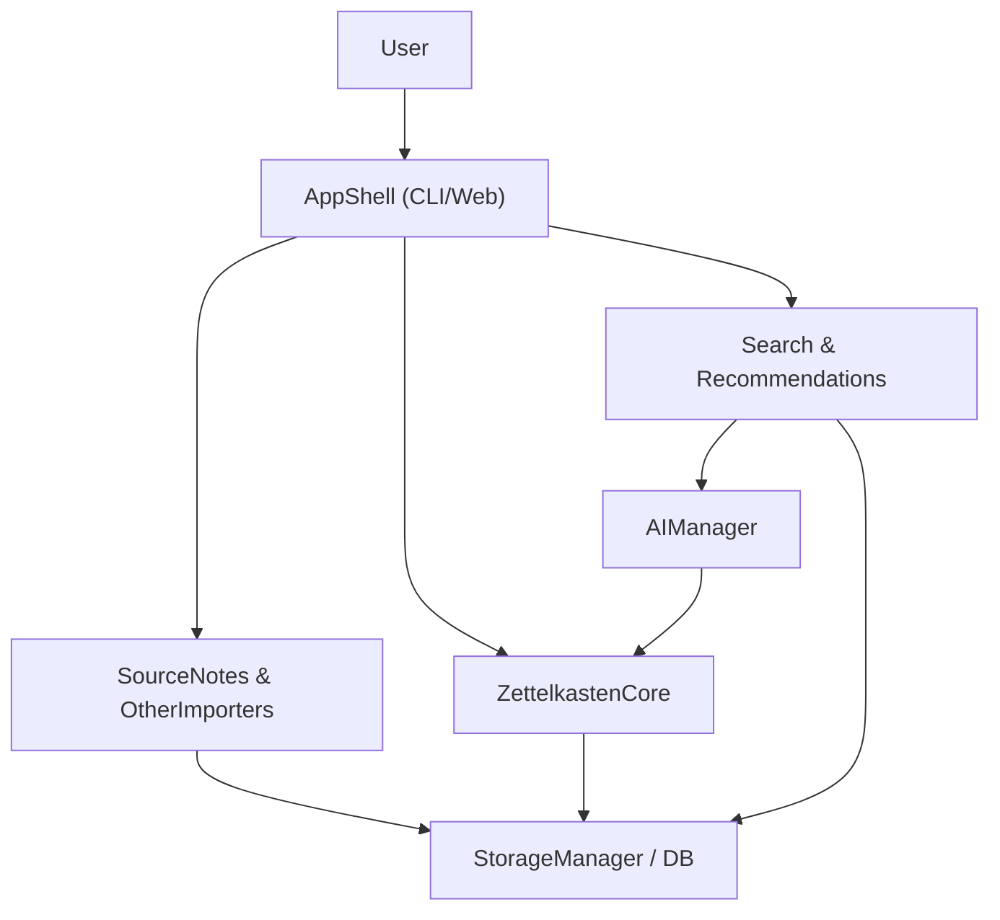

## Zettelkasten App – High-Level Architecture

The current codebase already has:

- `main.py`: entrypoint that asks for a YouTube URL and uses `SourceNotes`.
- `Module_SourceNotes/source_notes.py`: logic to fetch YouTube titles, transcripts, and save them as `.txt` files.
- `Module_SourceNotes/youtube_processor.py`: lower-level transcript fetching helper.
- `Module_AiManager`: placeholder for AI/groq integration (future semantic/AI features).

We’ll evolve this into a **three-layer architecture**:

- **Ingestion layer** (SourceNotes module): pull text from external sources (YouTube, PDFs, web pages, manual input) and normalize it into plain text.
- **Zettelkasten core** (Notes & Links + Storage): break text into atomic notes, tag them, store them, and maintain bidirectional links.
  - **Intelligence & UI** (AI Manager + App shell): surface notes, search, and suggested connections through a simple UI (CLI or web) and later AI features.

---

## Phase 1 – Solidify Source Notes Module (YouTube + Raw Text) - both 

**Goals**

- Make `SourceNotes` a clean, reusable class that can ingest different source types and always produce a canonical `SourceNote` record (id, title, source_url, raw_text, created_at).
- Keep the current YouTube pipeline but move file-system details into a Storage layer.

**Key design**

- Define a simple data structure (could be a `dataclass`) in a new module, e.g. `[Module_SourceNotes/models.py](Module_SourceNotes/models.py)`:
  - `SourceNote` with fields: `id`, `title`, `source_type` ("youtube", "pdf", "web", "manual"), `source_url`, `raw_text`, `created_at`.
- Refactor `SourceNotes.youtube_transcript()` so that instead of writing `.txt` directly, it:
  - Accepts a URL.
  - Fetches transcript (using existing yt-dlp + youtube-transcript-api logic).
  - Returns a `SourceNote` instance (or passes it to StorageManager) instead of doing file I/O.
- Add another simple method for manual text sources:
  - `SourceNotes.from_manual_input(text: str, title: str)` → returns `SourceNote`.

**Work split**

- **Person A**: finalize `SourceNotes` API & models, clean up transcript fetching using current working code.
- **Person B**: prepare a couple of example scripts/tests that call these methods and print resulting `SourceNote` objects (to validate behavior without touching storage yet).

---

## Phase 2 – StorageManager & Data Model (SQLite + Full-Text Search) - jay

**Goals**

- Centralize all persistence in a `StorageManager` class.
- Use SQLite with a simple schema and FTS (Full Text Search) to enable fast lookup of notes.

**Schema sketch** (in `[Module_Storage/storage.py](Module_Storage/storage.py)`):

- `notes` table:
  - `id` (primary key)
  - `title`
  - `body` (the full note text)
  - `source_type`
  - `source_url`
  - `created_at`
- `links` table (for Zettelkasten-style connections):
  - `id`
  - `from_note_id`
  - `to_note_id`
  - `relation_type` ("reference", "similar", "question", etc.)
- Optional: `tags` and `note_tags` tables.
- `notes_fts` virtual table using FTS5, pointing at `title` + `body` for fast search.

**StorageManager API examples**

- `save_source_note(source_note: SourceNote) -> note_id`
- `get_note(note_id) -> Note`
- `search_notes(query: str) -> List[Note]` (backed by FTS)
- `create_link(from_id, to_id, relation_type)` / `get_links(note_id)`

**Work split**

- **Person A**:
  - Design and implement SQLite schema and migrations (simple: create tables on first run).
  - Implement core `StorageManager` class and basic CRUD + FTS search.
- **Person B**:
  - Refactor `SourceNotes` to call `StorageManager.save_source_note()` instead of writing `.txt` files.
  - Keep the existing `Exported_Transcripts` export as an optional feature that uses `StorageManager` reads.

---

## Phase 3 – Zettelkasten Core: Breaking Sources into Atomic Notes - basil 

**Goals**

- Convert long `raw_text` from sources (e.g. a YouTube transcript) into **atomic notes** (smart chunks) that follow Zettelkasten practices.
- Attach metadata to each note so you can navigate and link them later.

**Design**

- New module `[Module_Zettelkasten/zettelkasten.py](Module_Zettelkasten/zettelkasten.py)` with:
  - `Note` dataclass: `id`, `source_note_id`, `title`, `body`, `created_at`.
  - `ZettelkastenManager` class with methods:
    - `create_notes_from_source(source_note: SourceNote) -> List[Note]`.
    - `link_notes_by_keywords(notes: List[Note])` (simple keyword-based initial linking).
- Initial splitting strategy (can be simple at first):
  - Split transcript into paragraphs by double newlines or by time-based chunks (e.g. ~3–5 sentences each).
  - Optionally, use **headings or timestamps** as titles (e.g. "Week 1 – C Basics" from your CS50 transcript).

**Work split**

- **Person A**:
  - Implement `Note` dataclass and `ZettelkastenManager`.
  - Build basic splitting heuristics and tests (e.g. given a sample transcript, verify it yields reasonable note sizes).
- **Person B**:
  - Integrate `ZettelkastenManager` into the ingestion pipeline:
    - After a `SourceNote` is saved, call `create_notes_from_source`.
    - Persist resulting notes in the `notes` table via `StorageManager`.

---

## Phase 4 – Search and Retrieval Features - jay

**Goals**

- Allow a user to quickly search old notes and surface relevant ones.
- Provide navigation that encourages making connections (view neighbors, links, related notes).

**Features**

- **Basic search** (CLI or simple UI):
  - `search <query>` lists matching notes (title snippet + first line of body).
- **Note view**:
  - Show full note text and metadata.
  - List links: incoming and outgoing (from `links` table).
- **Related notes** (Phase 1 implementation):
  - Use keyword overlap: notes sharing several uncommon words.
  - Optionally store a `similarity_score` when computing these relations.

**Implementation sketch**

- Add a `search.py` or extend `ZettelkastenManager` with:
  - `search_notes(query: str)` that wraps `StorageManager.search_notes` and adds ranking/formatting.
- Simple console UI in `main.py` (or a new CLI file):
  - Main loop: choose action: `1) Add source`, `2) Search notes`, `3) View note`, `4) Exit`.

**Work split**

- **Person A**: search + ranking logic; retrieval functions around `StorageManager`.
- **Person B**: CLI workflow in `main.py` that calls the above functions.

---

## Phase 5 – AI Manager for Summaries & Suggested Links -  both 

**Goals**

- Use your `Module_AiManager` ideas to:
  - Summarize long source notes or groups of notes.
  - Suggest links between notes based on semantic similarity (embeddings / LLM).

**Design**

- New module `[Module_AiManager/ai_manager.py](Module_AiManager/ai_manager.py)` with an `AIManager` class:
  - `summarize_note_text(text: str) -> str`.
  - `suggest_links_for_note(note: Note, candidates: List[Note]) -> List[(note_id, score)]`.
- Store a short **embedding vector** (or hash) per note if you use an embedding model; otherwise keep it simple at first:
  - Send note body to an LLM endpoint (Groq/OpenAI) and parse back suggested related note IDs based on titles/keywords.

**Integration**

- Add a command/UI option: `"Suggest connections for this note"`:
  - Fetch candidate notes (e.g. top 50 by keyword search).
  - Call `AIManager.suggest_links_for_note`.
  - Save suggested links to the `links` table (maybe mark them as `relation_type="ai_suggested"`).

**Work split**

- **Person A**: wiring to external AI API (env vars, simple client, error handling).
- **Person B**: integrate into `ZettelkastenManager` / CLI, including commands for users to accept/reject suggested links.

---

## Phase 6 – Optional Web UI (After Core Works) - basil 

**Goals**

- Replace or augment the CLI with a simple web app for better UX.

**Tech suggestion**

- Backend: FastAPI or Flask using existing Python modules (`SourceNotes`, `StorageManager`, `ZettelkastenManager`, `AIManager`).
- Frontend: minimal React or plain HTML+HTMX for:
  - Add source (URL or text).
  - Search and list notes.
  - View a note with its links and related notes.
  - Trigger AI actions (summarize, suggest links).

**Work split**

- **Person A**: API endpoints (e.g. `/sources`, `/notes`, `/search`, `/links`, `/ai/suggest-links`).
- **Person B**: frontend pages or components that call these APIs.

---

## Phase 7 – Quality, Testing, and Developer Experience - both

**Goals**

- Make the project sustainable and friendly for two collaborators.

**Tasks**

- Add a `README.md` explaining:
  - Project goals.
  - Setup (Python version, `pip install -r requirements.txt`).
  - How to run: `python main.py` or `uvicorn app:app` (if web).
- Add tests for critical logic:
  - Note splitting.
  - Search and FTS queries.
  - Link creation and retrieval.
- Use type hints and optionally `mypy` for static checking.
- Add a simple configuration file (e.g. `config.py` or `.env`) for DB path, AI keys, etc.

**Work split**

- **Person A**: testing for core logic and storage.
- **Person B**: documentation, CLI help text, and basic error handling paths.

---

## Suggested Work Division Strategy

- **Vertical slices per sprint** rather than strict file ownership, so both of you see end-to-end behavior:
  - Sprint 1: ingestion + storage MVP (Person A: StorageManager; Person B: SourceNotes integration and CLI command to add a source).
  - Sprint 2: Zettelkasten splitting + search (Person A: splitting & Note model; Person B: search & CLI integration).
  - Sprint 3: Links + simple recommendations (Person A: links table & API; Person B: UI around viewing/creating links).
  - Sprint 4: AI features (Person A: AIManager and external API calls; Person B: commands/UI to invoke AI and store results).
- Use Git branches and small PRs so each person can review the other’s changes, keeping design consistent with the plan above.

